

# PA4 Submission: TaskFlow Pipeline

Copy this file to <code style="color:#111827;background:#ddd6fe;padding:2px 4px;border-radius:4px;">SUBMISSION.md</code>. Put every screenshot in <code style="color:#111827;background:#ddd6fe;padding:2px 4px;border-radius:4px;">docs/</code>, embed it under the correct task, and write a short description below each image explaining what it proves. The grader should not need any file outside this repository.

## Student Information

| Field | Value |
|---|---|
| Name | Mahad Amir |
| Roll Number | 27100289 |
| GitHub Repository URL | https://github.com/mahadamir19/CS487-PA4 |
| Resource Group | `rg-sp26-27100289` |
| Assigned Region | `ukwest` |

## Evidence Rules

- Use relative image paths, for example: ``.
- Every image must have a 1-3 sentence description below it.
- Azure Portal screenshots must show the resource name and enough page context to identify the service.
- CLI screenshots must show the command and output.
- Mask secrets such as function keys, ACR passwords, and storage connection strings.

## Task 1: App Service Web App (15 points)

### Evidence 1.1: Forked Repository

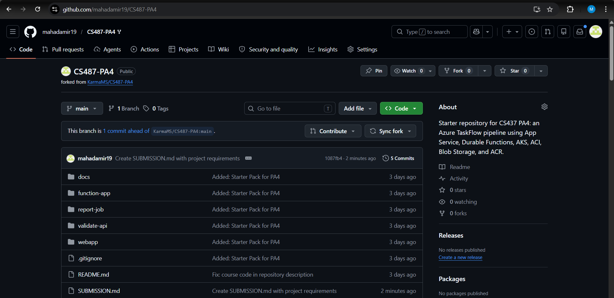

Description: This screenshot proves the CS487-PA4 starter repository was successfully forked to my personal GitHub account, which now acts as the central source code repository and deployment trigger for the Azure Web App

### Evidence 1.2: App Service Overview

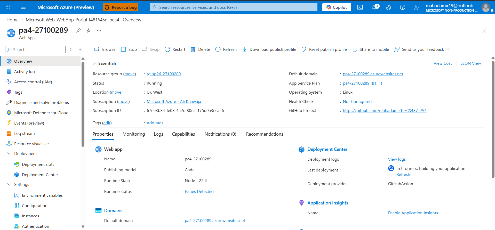

Resource group: rg-sp26-27100289

Region: UK West

Runtime: Node 22 LTS (Node 20 LTS was not available on the portal, I searched it but it did not appear in the search results).

Public URL: pa4-27100289.azurewebsites.net

### Evidence 1.3: Deployment Center / GitHub Actions

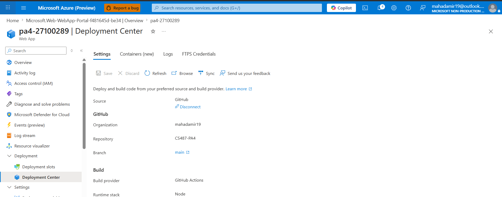

Description: This illustrates the Continuous Deployment (CI/CD) configuration linking the Azure Web App to the main branch of my GitHub fork. It demonstrates the use of a GitHub Actions workflow, authenticated via a publish profile, to automatically build the webapp/ directory and deploy the code to Azure

### Evidence 1.4: Live Web UI

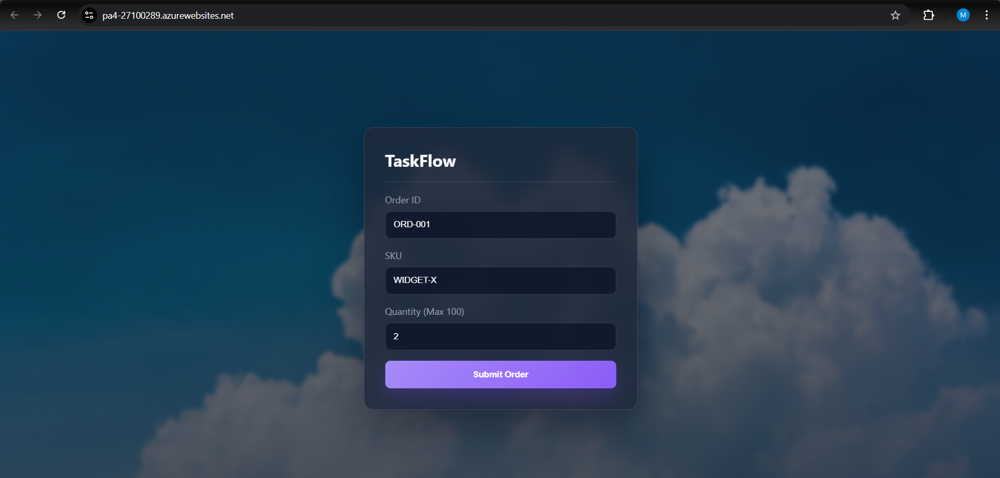

Description: This screenshot captures the live TaskFlow frontend accessible over HTTPS in a browser, confirming that the Node.js application was successfully built and is being served by the Azure App Service

### Evidence 1.5: App Settings

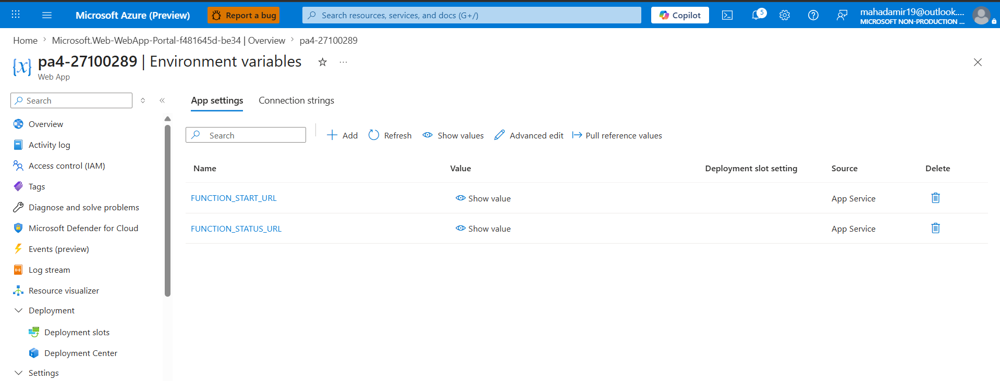

Description: This verifies the configuration of the FUNCTION_START_URL and FUNCTION_STATUS_URL environment variables within the Azure Portal

---

## Task 2: Azure Container Registry (15 points)

### Evidence 2.1: ACR Overview

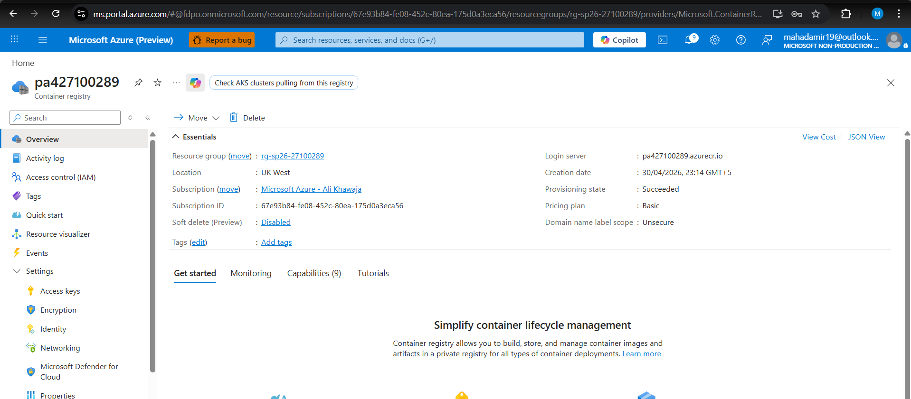

Description: SKU: Basic and Resource group: rg-sp26-27100289

### Evidence 2.2: Docker Builds

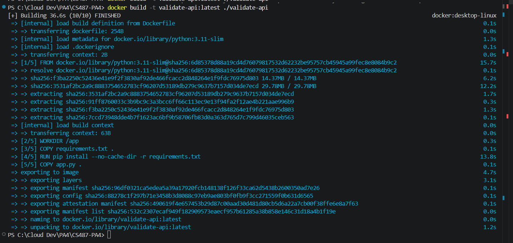
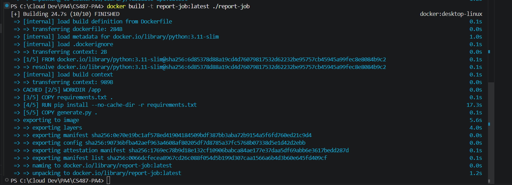
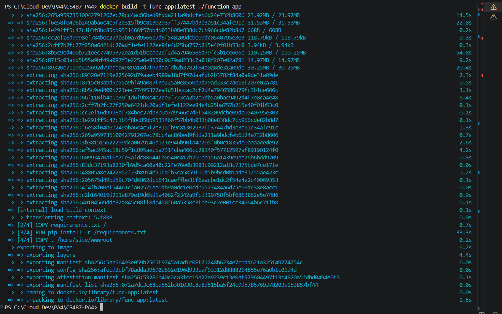

Description: The validate-api:latest image was built from the ./validate-api directory, the report-job:latest image from the ./report-job directory, and the func-app:latest image from the ./function-app directory

### Evidence 2.3: Testing validate api

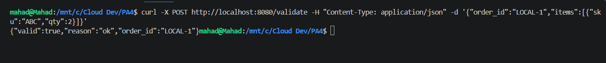

Description: The screenshot shows a curl POST request sent to localhost:8080/validate and the container successfully returning the expected JSON response ({"valid":true}), proving the application logic functions correctly before cloud deployment

### Evidence 2.4: Pushing images

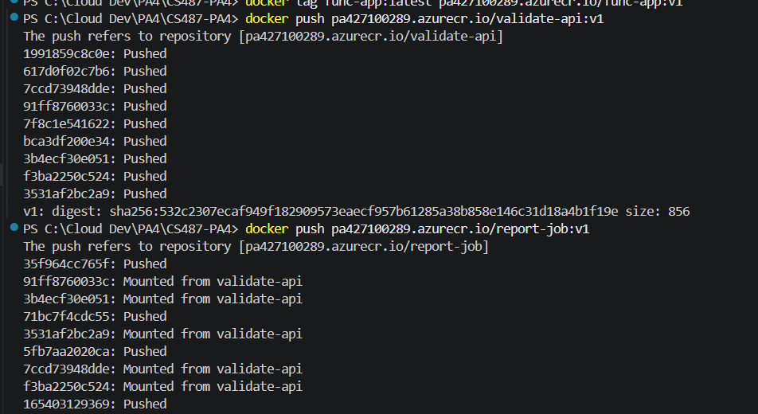
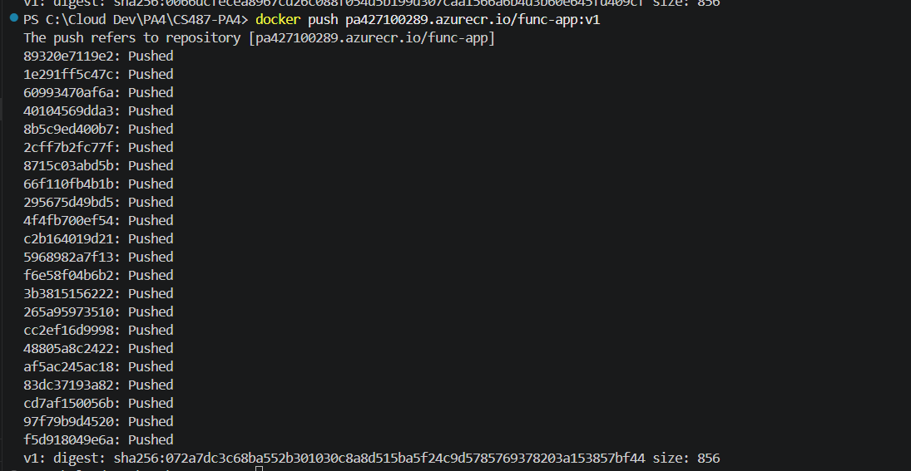

Description: These screenshots show the local images being successfully tagged with the pa427100289.azurecr.io login server prefix and pushed to the cloud using the docker push command

### Evidence 2.5: ACR Repositories

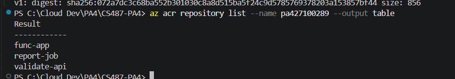

Description: This screenshot confirms that all three required container repositories—validate-api:v1, report-job:v1, and func-app:v1—were successfully published to Azure

---

## Task 3: Durable Function Implementation (12 points)

### Evidence 3.1: Completed Function Code

[function_app.py](function-app/function_app.py)

Description: This file contains the complete Durable Function logic, demonstrating the sequential chaining of activities. The orchestrator uses the yield keyword to pause and checkpoint execution while calling validate_activity, disrupts the workflow if the order is rejected, and only proceeds to trigger report_activity if the validation is successful.

### Evidence 3.2: Local Function Handler Listing

TODO: 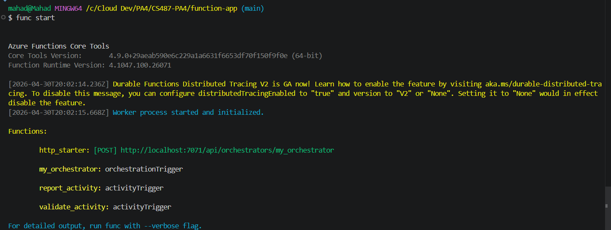

Description: This screenshot verifies that the local Azure Functions Core Tools successfully compiled the Python code and registered all four required Durable Function handlers (the HTTP starter, the orchestrator, and the two activity triggers) without any binding errors.

---

## Task 4: Function App Container Deployment (8 points)

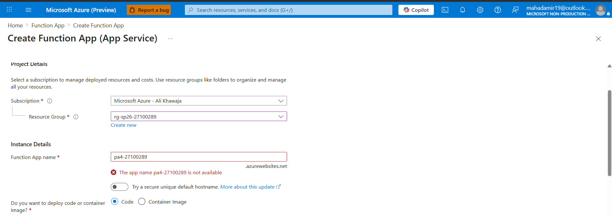
There was a naming conflict for the function app so I named to to pa4-func-27100289

### Evidence 4.1: Function App Container Configuration

Description: TODO: Function app name: pa4-func-27100289 and image URI: pa427100289.azurecr.io/func-app:v1

### Evidence 4.2: Functions List

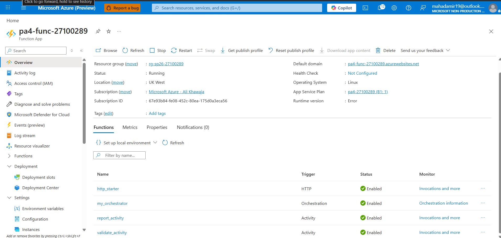

Description: This screenshot confirms that the container deployed successfully and the Azure Functions runtime recognized the four required Durable Function components: http_starter, my_orchestrator, validate_activity, and report_activity

### Evidence 4.3: Orchestration Smoke Test

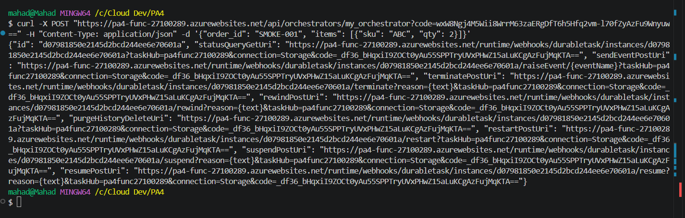

Description: The returned id and statusQueryGetUri prove that the http_starter function successfully received the curl POST request, authenticated using the function key, and correctly initialized a new instance of the Durable Orchestrator (my_orchestrator). It also confirms that the Function App is properly connected to its underlying Azure Storage account to track orchestration state.

### Evidence 4.4: Expected Failed Status Before Downstream Wiring

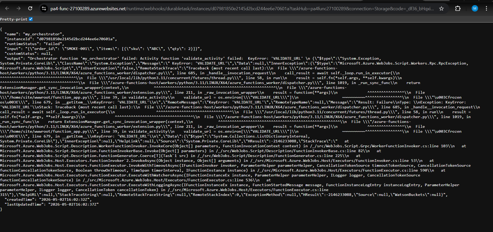

Description: This failure is expected at this stage because the orchestration successfully started and moved to the first activity (validate_activity), which attempts to make an HTTP call to the VALIDATE_URL. Since the Azure Kubernetes Service (AKS) validator microservice is not deployed and wired up until Task 5, the network call fails, causing the orchestration to correctly checkpoint as Failed.

---

## Task 5: AKS Validator (15 points)

### Evidence 5.1: AKS Cluster

TODO: Embed screenshot of AKS overview showing `aks-<rollnum>` succeeded.

Description: TODO: State node count, node size, region, and resource group.

### Evidence 5.2: Kubernetes Nodes and Pods

TODO: Embed screenshot of `kubectl get nodes` and `kubectl get pods`.

Description: TODO: Explain that the validator pod is scheduled and running.

### Evidence 5.3: Kubernetes Service

TODO: Embed screenshot of `kubectl get service validate-service`.

Description: TODO: Identify the external IP and port exposed by the LoadBalancer.

### Evidence 5.4: Validator API Tests

TODO: Embed screenshot of `curl /health`, a valid `curl /validate`, and an invalid `curl /validate`.

Description: TODO: Explain the accepted path and the `qty > 100` rejection rule.

### Evidence 5.5: Function App `VALIDATE_URL`

TODO: Embed screenshot showing the Function App application setting `VALIDATE_URL`.

Description: TODO: Explain how the Durable Function reaches the AKS validator.

### Evidence 5.6: AKS Idle Behavior

TODO: Embed AKS metrics screenshot and/or `kubectl` output after the service is idle.

Description: TODO: Explain that the AKS node remains running even when there are no orders.

---

## Task 6: ACI Report Job (15 points)

### Evidence 6.1: Blob Container

TODO: Embed screenshot of the `reports` blob container.

Description: TODO: Explain where generated PDFs are stored.

### Evidence 6.2: Manual ACI Run

TODO: Embed screenshot of `az container show` for `ci-report-test`.

Description: TODO: State the final container state and why the job exits.

### Evidence 6.3: ACI Logs

TODO: Embed screenshot of `az container logs`.

Description: TODO: Explain what the report job printed after generating and uploading the PDF.

### Evidence 6.4: Generated PDF

TODO: Embed screenshot showing `TEST-001.pdf` in Blob Storage or opened from Blob Storage.

Description: TODO: Explain how this proves the ACI wrote to storage.

### Evidence 6.5: Function App Managed Identity and IAM

TODO: Embed screenshots of system-assigned identity enabled and Contributor role assignment on your resource group.

Description: TODO: Explain why the Function App needs this permission to create ACIs.

### Evidence 6.6: Report App Settings

TODO: Embed screenshot of `REPORT_*`, `ACR_*`, `STORAGE_CONN`, and `SUBSCRIPTION_ID` settings.

Description: TODO: Explain what each group of settings is used for. Mask secrets.

---

## Task 7: End-to-End Pipeline (15 points)

### Evidence 7.1: Web App Wiring

TODO: Embed screenshot showing `FUNCTION_START_URL` and `FUNCTION_STATUS_URL` configured on the Web App.

Description: TODO: Explain how the frontend starts and polls the Durable orchestration.

### Evidence 7.2: Happy Path UI

TODO: Embed screenshots of the form before submit, Running status, and Completed status with report URL.

Description: TODO: Explain the valid order payload and final result.

### Evidence 7.3: Backend Participation

TODO: Embed screenshots showing Function App invocation, AKS validator evidence, ACI evidence, and Blob PDF evidence.

Description: TODO: Trace the same order ID across services.

### Evidence 7.4: Reject Path UI

TODO: Embed screenshot of an order with `qty > 100` being rejected.

Description: TODO: Explain why no report ACI should be created for this order.

---

## Task 8: Write-up and Architecture Diagram (5 points)

### Evidence 8.1: Architecture Diagram

TODO: Embed your architecture diagram from `docs/`.

Description: TODO: Confirm that it shows GitHub, App Service, Durable Function, AKS, ACI, Blob Storage, ACR, and IAM.

### Question 8.2: Service Selection

TODO: In 3-4 sentences each, explain why TaskFlow uses App Service, Durable Functions, AKS, and ACI for their specific roles.

### Question 8.3: ACI vs AKS

TODO: Compare idle behavior, cost behavior, and operational model for AKS and ACI using your screenshots.

### Question 8.4: Durable Functions vs Plain HTTP

TODO: Explain at least two problems that Durable Functions solves for this sequential workflow.

### Question 8.5: Cost Review

TODO: Embed Cost Management screenshot scoped to your resource group.

Description: TODO: Identify the most expensive resource and explain why.

### Question 8.6: Challenges Faced

TODO: Describe at least two real issues you hit and how you debugged them.

---
